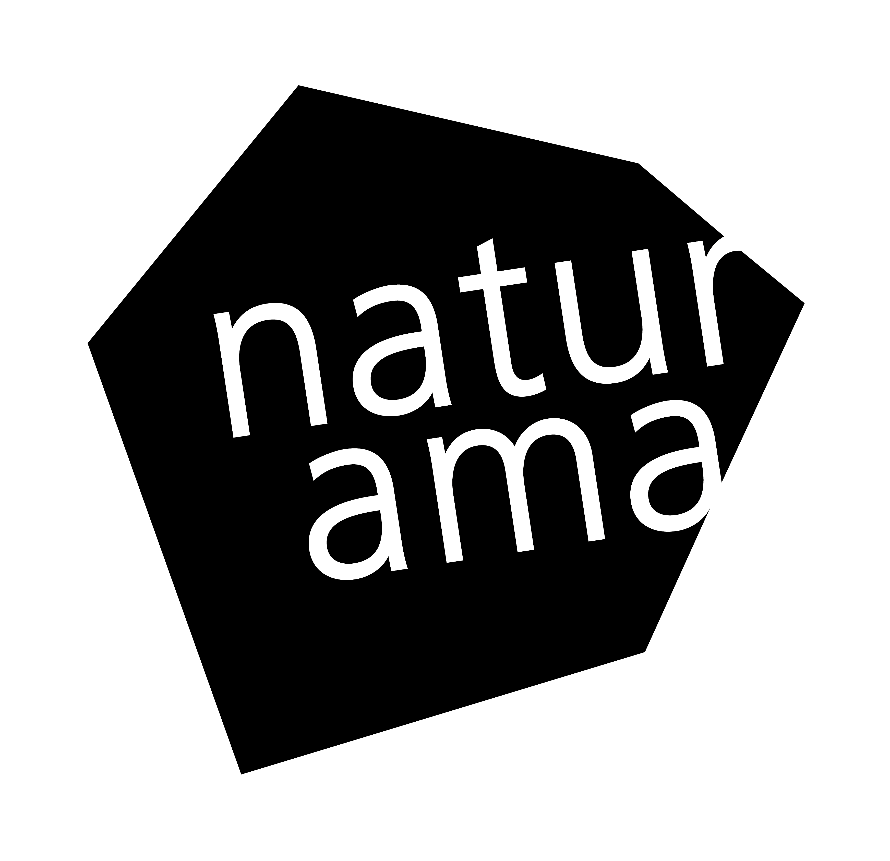

# Musea

Ein System zur Steuerung und Verwaltung verschiedener Medienstationen.

## Was kann Musea?
Musea ist ein System zur zentralen Steuerung von Multimedia-Installationen 
in Ausstellungen und Museen. Perfekt für Führungen, Dauerausstellungen und 
interaktive Installationen.

📚 **Zentrale Medienverwaltung** – Mediendateien (Videos und Bilder) zentral verwalten

📱 **Tablet-Steuerung** – Über intuitive Tablet-Anwendungen die Inhalte steuern

🎬 **Synchrone Wiedergabe** – Videos werden synchron auf mehreren Displays abgespielt

💡 **DMX-Lichtsteuerung** – Beleuchtung passt sich automatisch den Medien an

🔧 **Modular erweiterbar** – Flexible Erweiterung der Medien-Player möglich

## Für wen ist Musea gedacht?
- Museen mit Multimedia-Installationen
- Szenografen und Ausstellungsgestalterinnen
- Kulturinstitutionen mit wechselnden Ausstellungen

## Angebot
Die Software ist Open Source und kostenlos nutzbar. 
Ich biete professionellen Support für:
- Installation und Einrichtung
- Schulung des Personals
- Anpassungen und Erweiterungen für Ihre spezifischen Anforderungen

📧 Kontakt: mail@enniomariani.ch

## Benötigte Kenntnisse für die Installation
- IP-Adressen aus Windows auslesen
- Programm in der Windows-Firewall freigeben (Musea-Player)
- Ping-Befehle in der Windows-Firewall freigeben (Musea-Player)
- Text-Datei anlegen und editieren (Musea-Guide)

## Schnellstart für Windows

🎥 [Info-Video (2:50)](https://www.youtube.com/watch?v=k5L5h5DrS04) zur Installation und Basiskonfiguration

**Computer A** (Computer mit Beamer oder Monitor)
- [Musea-Player](https://github.com/enniomariani/Musea-Player) herunterladen
- Programm öffnen → Wichtig: Firewallmeldung akzeptieren (siehe [detaillierte Anleitung](https://github.com/enniomariani/Musea-Player))
- IP-Adresse des Computers aufschreiben (IP X)

**Computer B** (Computer für die Verwaltung der Medienstationen)
- [Musea-Admin](https://github.com/enniomariani/Musea-Admin) herunterladen
- Programm öffnen
- Medienstation hinzufügen → Namen wählen
- Administration (⚙️) öffnen → Player hinzufügen → Name definieren + IP X eingeben
- Beenden anklicken
- Medienstation öffnen, Ordner, Contents, Medien erstellen/hinzufügen → synchronisieren und beenden

**Computer / Tablet C** (Tablet/PC zur Steuerung der Player, z.B. für Führungen)
- [Musea-Guide](https://github.com/enniomariani/Musea-Guide) herunterladen
- im Ordner ``resources/daten`` die Datei ``savedMediastations.json`` erstellen → mit einem Text-Editor öffnen und folgendes eintragen:

``{
 "mediaStations": [
             {"name": "temporärer Name der MS, wird beim öffnen überschrieben", "ip": "IP X"}
       ]
}``
- Programm öffnen
- Medienstation öffnen
- Contents anklicken → Medien sollten auf Computer A abgespielt werden

🚧 [Mehr Informationen](docs/user) für Benutzer:innen.

## Anforderungen an das bestehende System
- Alle beteiligten Geräte müssen im selben Subnetz sein
- Anpassung der Firewall-Einstellungen auf den Musea Playern → siehe [detaillierte Anleitung](https://github.com/enniomariani/Musea-Player)
- Netzwerk-Kommunikation erfolgt standardmässig über Port 5000
- Auf dem Computer, auf dem Musea Player oder Musea Admin läuft sollte mindestens 3x so viel RAM zur Verfügung stehen wie die grösste Datei, die synchronisiert wird

## Einschränkungen
- Die Apps sind momentan nur für Windows 10 und 11 verfügbar
- Musea Admin: Medienstationen und hinzugefügte Player können momentan umbenannt, aber nicht gelöscht werden
- Musea Admin und Musea Guide dürfen nicht gleichzeitig auf demselben Computer ausgeführt werden
- Soll ein Player von der einen in eine andere Medienstation verschoben werden, müssen alle Medien und Metadaten manuell gelöscht werden
- Getestet mit Video-Dateien bis 1.5 GB

## 🚀 Alle Programme
- **[Musea Player](https://github.com/enniomariani/Musea-Player)** - Medien abspielen, DMX-Lichter steuern
- **[Musea Admin](https://github.com/enniomariani/Musea-Admin)** - Musea Player zu Medienstationen zusammenführen, Ordner und Contents erstellen, Medien hinzufügen
- **[Musea Guide](https://github.com/enniomariani/Musea-Guide)** - Medien auf den Playern synchronisiert abspielen, Medien mit Tags zu Playlisten gruppieren

## 📦 npm Pakete
- **[musea-client](https://github.com/enniomariani/Musea-Client)**   - Medien auf den Servern verwalten, synchronisieren, löschen und abspielen
- **[musea-server](https://github.com/enniomariani/Musea-Server)**   - Server der Medien-Player: Speichert/löscht Medien, sendet DMX-Signale an angehängte Lampen

## Kompatibilität verschiedener Versionen
Die Versions-Nummern der Apps orientieren sich an der [semantischen Versionierung](https://semver.org/).

Nur Apps mit derselben Major-Version (z.B. 2.X.Y) sind kompatibel.

## Technische Übersicht

🚧 [Technische Dokumentation](docs/dev/README.md)

## Förderung & Danksagung
Dieses Projekt wurde grösstenteils durch das [Naturama Aargau](https://naturama.ch/) finanziert.

Herzlichen Dank an [Niklas Dunke](https://www.linkedin.com/in/niklas-dunke-5b9044191/) für das Design und die Benutzererfahrung!

## Lizenz

Dieses Projekt steht unter der [GNU General Public License v3.0](LICENSE).

Das bedeutet: Der Code darf genutzt, verändert und weitergegeben werden, aber abgeleitete Werke müssen ebenfalls unter GPL-3.0 veröffentlicht werden.
