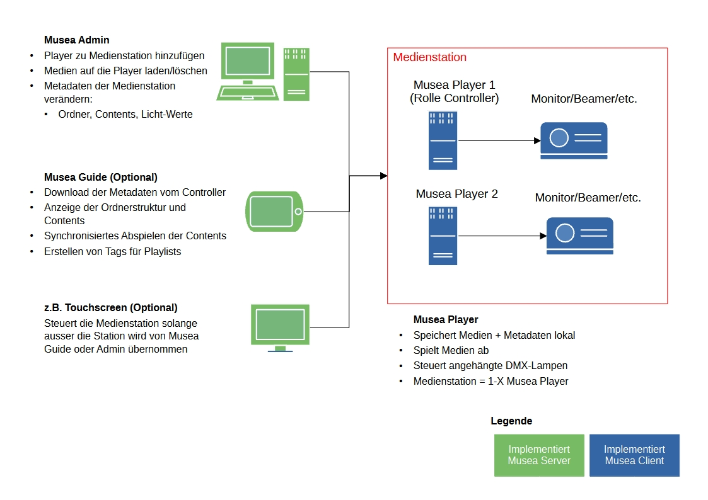

# Technische Dokumentation

## Gesamtarchitektur
Die Softwarelösung besteht aus drei Apps, die über das Netzwerk kommunizieren:

- **[Musea Player](https://github.com/enniomariani/Musea-Player)**: Spielt Medien ab und steuert DMX-Lichter.
- **[Musea Admin](https://github.com/enniomariani/Musea-Admin)**: Kombiniert Musea Player zu Medienstationen, erstellt Ordner, Contents und fügt Medien hinzu.
- **[Musea Guide](https://github.com/enniomariani/Musea-Guide)**: Spielt Medien synchron ab, gruppiert Contents mit Tags zu Playlisten.

**Verbindungsrollen:**
- Musea Player sind immer die Server. Client-Apps (momentan Musea Guide und Admin) können gleichzeitig die Verbindung mit mehreren Musea Playern offen haben.
- Musea Admin und Musea Guide agieren als Rolle "admin", wenn sie mit einem Musea Player verbunden sind. Nur eine dieser Apps kann gleichzeitig verbunden sein.
- Musea Player akzeptieren aber zusätzlich eine Verbindung mit der Rolle "user". Dies kann z.B. ein Touchscreen für Benutzer sein. Wenn der Musea Player eine "admin"-Verbindung erhält, sendet er ein "blockieren"-Signal an die "user"-Verbindung, der Touchscreen wird gesperrt solange die "admin"-App verbunden ist.

**npm Pakete**
- **[musea-client](https://github.com/enniomariani/Musea-Client)**   - Medien auf den Servern verwalten, synchronisieren, löschen und abspielen
- **[musea-server](https://github.com/enniomariani/Musea-Server)**   - Server der Medien-Player: Speichert/löscht Medien, sendet DMX-Signale an angehängte Lampen

## Wichtige Begriffe und Datenstruktur
Siehe [Wichtige Begriffe und Datenstruktur](../general/data-structure.md).

## Kompatibilität verschiedener Versionen
Nur Apps mit derselben Major-Version (z.B. 2.X.Y) sind kompatibel.

Die Versions-Nummern der Apps orientieren sich an der [semantischen Versionierung](https://semver.org/).

## Rolle der Musea Player
Ein Musea Player kann die Rolle **default** oder **Controller** haben.

**Controller**
- Der erste Musea Player, der über Musea Admin einer Medienstation zugeordnet wird, wird als Controller definiert
- Alle Informationen zu Ordnerstruktur, Contents, IP-Adressen der anderen Musea Playern, etc. werden als contents.json auf dem Controller abgelegt
- Die Apps mit der Rolle Controller können alles auch, was die Apps mit der Rolle Default können

**Default**
- Alle anderen Musea Player in einer Medienstation haben diese Rolle
- Kann Medien empfangen, löschen und abspielen
- Kann "Systembefehle" empfangen - z.B. Audio muten/unmuten

## Kommunikation zwischen den Apps
Die Apps komunizieren über WebSocket-Verbindungen.
Die gesamte Kommunikation wird von den Bibliotheken Musea Client und Musea Server übernommen.
Für die Kommunikation wurde ein [eigenes Protokoll](network-protocol.md) entwickelt.

## Testkonzept
- **Unit Tests**: Jest
- **End-to-End Tests**: WebdriverIO

**Musea Client**
- Teilweise mit TDD entwickelt
- Wichtigste Funktionen mit Unit Tests abgedeckt
- keine e2e-tests: e2e-tests werden durch Musea Guide und Musea Admin abgedeckt

**Musea Server**
- Teilweise mit TDD entwickelt
- Wichtigste Funktionen mit Unit Tests abgedeckt
- Testen der Netzwerk-Kommunikation mit e2e-tests

**Musea Guide/Admin**
- Wichtigste Funktionen mit Unit Tests abgedeckt (ausgenommen Views)
- e2e-tests für die relevantesten Funktionen der Apps

**Musea Player**
- Wichtigste Funktionen mit Unit Tests abgedeckt

**Manuelle Tests**
- das Zusammenspiel der Apps immer auch manuell testen
- DMX-Signale beim Musea Player (z.B. mit com0com um Signale an der COM-Schnittstelle zu überprüfen)
- Bei Updates in der Netzwer-Kommunikation auch mit grossen Files >1 GB testen

## Mögliche Erweiterungen
Die Bibliothek Musea Server wurde mit der Idee entwickelt, in verschiedenen Medien-Playern einsetzbar zu sein.
Momentan gibt es einen Standard-Player, der Videos und Bilder abspielen kann: [Musea Player](https://github.com/enniomariani/Musea-Player).
