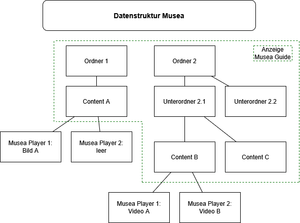

# Wichtige Begriffe und Datenstruktur

## Wichtige Begriffe

| Begriff            | Bedeutung                                                                                                        |
|--------------------|------------------------------------------------------------------------------------------------------------------|
| **Medien**         | Videos oder Bilder (später evtl. mehr).                                                                          |
| **Content**        | Ein «Inhalt», der aus einem oder mehreren Medien besteht. Benutzer:innen wählen nur Contents aus.                |
| **Musea Player**   | Programm das Medien abspielt.                                                                                    |
| **Musea Admin**    | Programm zur Verwaltung der Musea Player über das Netzwerk. Hier werden Contents erstellt und Medien zugewiesen. |
| **Medienstation**  | Mehrere in Musea Admin zusammengehängte Musea Player.                                                            |
| **Musea Guide**    | App zur Steuerung der Medienstationen.                                                                           |
| **Controller-App** | Musea Player mit «Controller»-Rolle, speichert die «contents»-Datei (Metainformationen zu den Contents).         |

## Datenstruktur

### Musea Admin
- Erstellen von Ordnern mit beliebig vielen Unterordnern
- Erstellen von Contents in den Ordnern
- Jedem Musea Player der aktuellen Medienstation kann pro Content ein Medium zugeordnet werden
- Speichern der Datenstruktur auf dem Musea Player mit der Rolle "Controller"

**Info:** Medien können gemischt werden:  
- Media Player 1 hat ein Video,  
- Media Player 2 ein Bild.

In einem Content kann auch ein Player leer bleiben.

---

### Musea Guide
- Lädt die Datenstruktur vom Musea Player mit der Rolle "Controller" herunter
- Stellt die Ordnerstruktur dar
- Benutzer:innen können Contents abspielen
- Zeigt an, welcher Medientyp auf welchem Musea Player läuft

---

